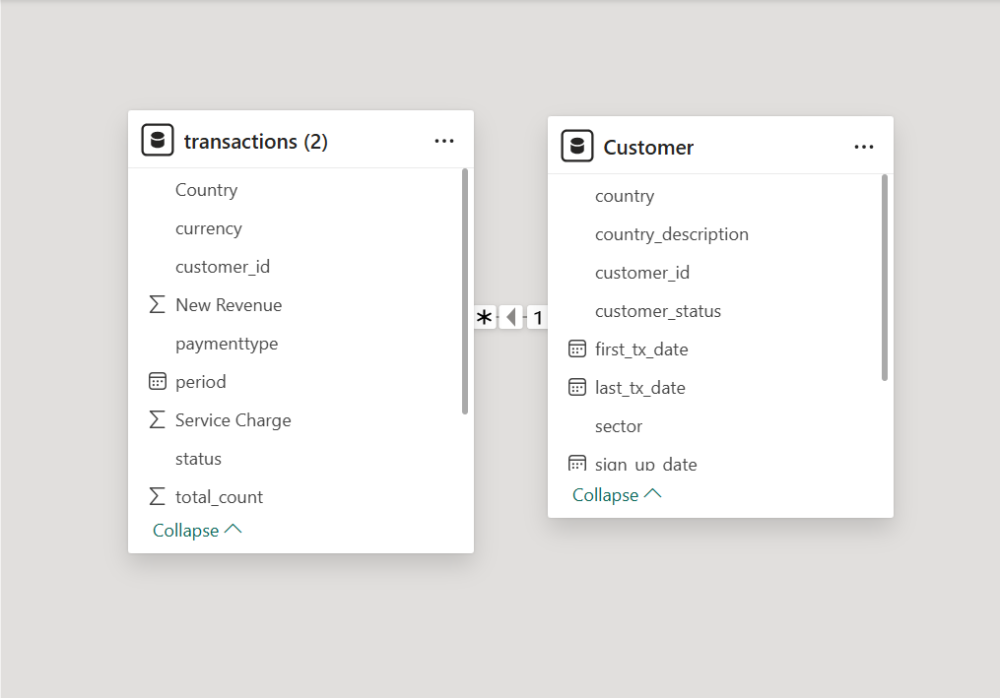
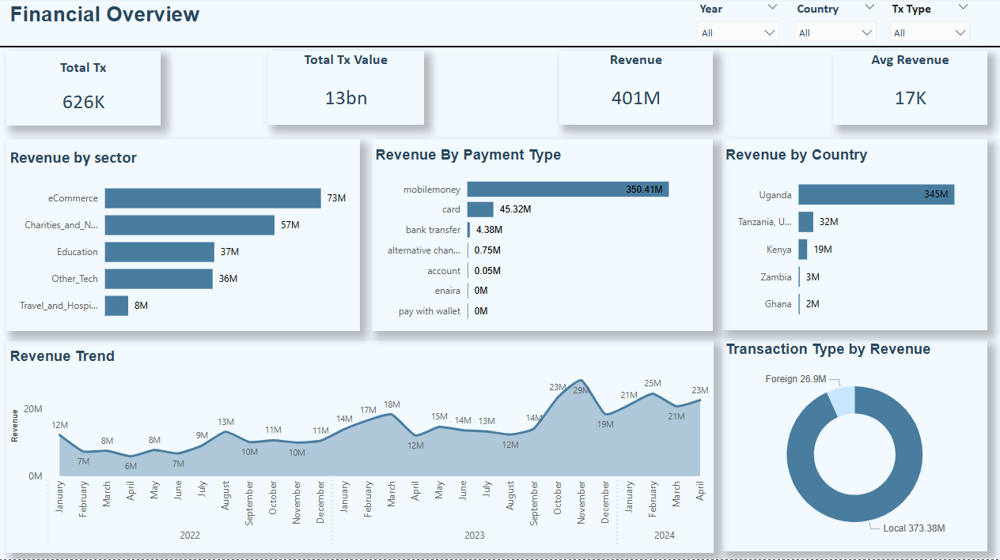
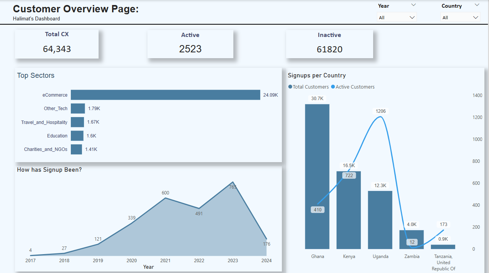

# FlutterWave-Financial-Analysis

## Introduction

This project is a Power BI financial analysis of a fintech payment company, examining transaction trends from 2022 to 2024. The analysis focuses on user engagement, revenue performance, and payment behaviours across five African countries.

**_Disclaimer**_: This dataset and report do not represent any real company, institution, or country. It is a dummy dataset created solely to demonstrate data analysis and visualization capabilities using Power BI.

## Problem Statement
1. What is the user retention rate like?
2. Which is the highest revenue-generating country?
3. What is the top payment method used?

## Skills and Concepts Demonstrated

The following Power BI skills were incorporated:
- Dax
- Data Modeling
- Drill-through & Drill-down
- Custom Visuals

The following Data Analysis & Business Intelligence Concepts were incorporated:
- Data Cleaning & Transformation
- Trend Analysis
- Comparative Analysis
- Customer Segmentation
- Financial Metrics Calculation

## Modelling:

Established a many-to-one relationship between the transaction table (which is my fact table) and the customer table (which is the dimension table) using the customer_id key, implementing a star schema for efficient data modelling in Power BI.

## Visualization

The report comprises two pages:
1. Financial Overview
2. Customer Overview

You can interact with the report [here](https://app.powerbi.com/groups/me/datasets/a4268c57-5732-4f47-851d-9044fe349172/details?experience=power-bi)

Features:
- The Year, Country, and Tx Type (Transaction Type) are slicers on both pages.

## Analysis:

### Financial Overview:

- The platform generated $400 million in revenue, with Uganda leading at ₦344 million.
- Mobile Money is the most-used payment method, contributing the highest transaction volume.
- E-commerce revenue is declining, signalling a need for sectoral revitalization.
- Local transactions generated over $300 million in revenue

### Customer Overview

- Over 8,000 users signed up between 2022–2024, but only 16.47% remained active.
- Tanzania had the highest retention (27%), showing strong customer loyalty.
- The highest population of customers are from the E-commerce sector.
- 2023 recorded the highest active customers.

  **_Read full report_** [Here](https://drive.google.com/file/d/1Du3mF1sJzRazGHhfHMgtIFMlMejwm1ZH/view?usp=sharing)

## Recommendation
- Implement loyalty programs and targeted reactivation campaigns to improve user retention.
- Expand marketing efforts in high-performing regions like Uganda and Tanzania to drive further growth.
- Revitalize declining sectors, especially E-commerce, through promotions and partnerships.
- Optimize foreign transaction fees to encourage cross-border payments and increase revenue.
- Enhance payment options, promoting Mobile Money while improving underutilized methods like "Pay with Wallet."

## Conclusion
- The platform generated ₦400 million in revenue from ₦13.38 billion in transactions, with Uganda leading in contributions.
- User retention remains low (16.47%), highlighting the need for engagement strategies.
- E-commerce revenue is declining, requiring targeted interventions to sustain growth.
- Foreign transactions contribute only 7% of revenue, signalling an opportunity for expansion.
- Implementing data-driven strategies will improve retention, revenue diversification, and overall platform success.
